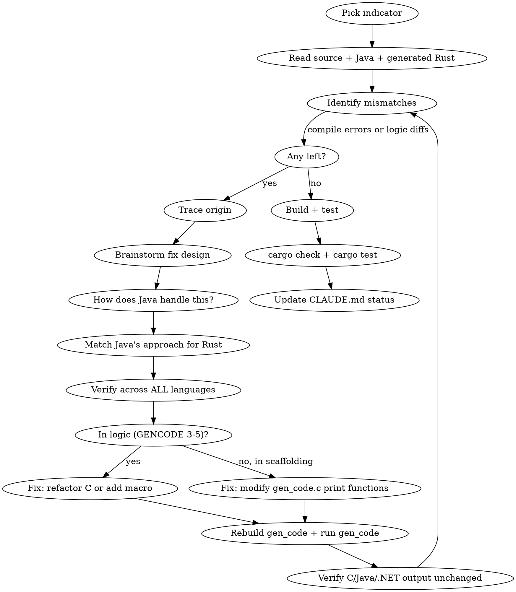

# Convert TA-Lib Indicator to Rust

Convert a C/Java technical indicator function to cross-language Rust output via the gen_code pipeline.

## Usage

- `/convert-indicator` — resume current indicator or pick next
- `/convert-indicator SMA` — work on specific indicator

## Design Principles

### Java is the reference target

**Always match the Java approach.** Java and Rust are the two type-safe targets. When Java uses an enum, Rust should use an enum. When Java skips runtime validation because the type system enforces safety, Rust should do the same. C's weaker type system is not the model.

### Prefer stronger safety

When choosing between runtime validation (C-style `(int)` casts and range checks) and compile-time safety (proper enum types, Rust's type system), always prefer compile-time safety. This means:

- Use proper Rust enums for TA-Lib enums (`MAType`, `RetCode`, `Compatibility`, etc.) — don't flatten to `i32`
- Add Rust to exclusion guards alongside Java/.NET where type safety makes runtime checks unnecessary (e.g., `#if !defined(_MANAGED) && !defined(_JAVA) && !defined(_RUST)`)
- Start without `#[repr(i32)]` unless a code path genuinely needs enum↔integer conversion. If the generated code only matches on variants (via `ENUM_CASE`), integer conversion is unnecessary.
- If integer conversion IS needed later, add `#[repr(i32)]` and `TryFrom<i32>` — don't downgrade the enum to `i32`

### Cross-language verification is mandatory

**Every proposed fix MUST be verified across all language targets before implementation.** A change that fixes Rust can break C, Java, or .NET.

Before applying ANY fix:

1. **Use brainstorming skill** (`superpowers:brainstorming`) to explore the fix design
2. **Trace the affected code path across ALL languages** — check C, Java, .NET output, not just Rust
3. **Verify assumptions about types** — a parameter may be `int` for one function and `TA_MAType` (enum) for another, using the same generator code path
4. **Check for conditional exclusions** — generators use `#if !defined(_JAVA)`, `#if !defined(_MANAGED)` to skip code for certain languages. Rust may inherit C-only code paths that Java/.NET already solved differently.
5. **Quadruple-check before committing** — if a fix seems "obvious" (like removing a cast), that's when you most need to verify

**Use TDD** (`superpowers:test-driven-development`) for all Rust code changes.

### Zero regressions

**Existing tests must never be deleted or start failing.** Every change must preserve all passing tests across all languages. If a fix causes a previously-passing test to fail, the fix is wrong — find a different approach. This means:

- `TA_FUNC_NO_RANGE_CHECK` is too aggressive — it removes ALL validation including basic range checks like `endIdx < startIdx`, causing test regressions
- Prefer targeted fixes (macros, exclusion guards) over blunt instruments that disable entire code paths
- Run ALL tests after every change, not just the indicator you're working on

### Small, reviewable commits

This project requires **small, atomic commits** that are easy for humans to review. Each commit should:

- Do ONE thing — a single macro addition, a single generator fix, a single test
- Have a clear, descriptive commit message explaining WHY, not just WHAT
- Be independently verifiable — reviewer can check C/Java/Rust output in one pass
- Never mix generator changes with unrelated source changes

Bad: "Add SMA support to Rust" (massive commit touching 10 files)
Good: Sequence of commits like "Add DECLARE_DOUBLE_VAR macro to ta_defs.h", "Use DECLARE_DOUBLE_VAR in ta_SMA.c logic section", "Regenerate SMA output after macro changes"

### Address all warnings

Compiler warnings are bugs waiting to happen. After every rebuild:

- `cargo check` must produce zero warnings (not just zero errors)
- Fix warnings at the source, not with `#[allow(...)]` unless there's a strong reason (e.g., `non_snake_case` for API compatibility)
- gen_code runs `cargo fix --allow-dirty` automatically, but verify nothing slipped through

## Workflow



## Fix Priority (try in order)

1. **Light C refactoring** — remove unnecessary syntax that happens to be invalid in Rust (missing braces, etc.). BUT: verify the syntax is truly unnecessary across all parameter types and languages first.
2. **New macro in `ta_defs.h`** — when syntax genuinely differs or has semantic meaning in some code paths. MUST include `#else` default for C/Java/.NET.
3. **Generator change in `gen_code.c`/`gen_rust.c`** — when scaffolding print functions need different output per language.

**Red flag**: If a fix looks like "just remove this" — STOP. Trace every code path that hits the same generator function. Example: `(int)` casts look like no-ops for `int` params but do real enum-to-int conversion for `TA_MAType` params, and the same `printOptInputValidation()` handles both.

## Step-by-step

### 1. Pick or resume indicator

Check `RUST_SUPPORTED_FUNCS` in `gen_code.c:111` for currently enabled indicators (CSV list). Check `rust/src/ta_func/` for existing `.rs` files. If resuming, run `cargo check` in `rust/` to see current errors.

### 2. Read the three views

| File | Purpose |
|------|---------|
| `src/ta_func/ta_XXX.c` | Source of truth — hand-written logic between GENCODE 3-5 |
| `java/src/com/tictactec/ta/lib/Core.java` | Reference — search for function name, shows working Java output |
| `rust/src/ta_func/xxx.rs` | Generated Rust — compare against Java for mismatches |

### 3. For each mismatch, brainstorm and trace

**Brainstorm**: Use `superpowers:brainstorming` to explore fix options.

**Ask "How does Java handle this?"** — Java is the reference. If Java uses an enum type, Rust should too. If Java skips a validation block, Rust should too. Don't default to C's approach.

**Trace**: Is the bad syntax in the logic sections (ta_XXX.c between GENCODE 3-5) or in the generated scaffolding (gen_code.c's `printFunc`, `printOptInputValidation`, `writeFuncFile`)?

**Verify cross-language**: Check what C, Java, .NET each generate for this same code path. Look for `#if !defined(_JAVA)` / `#if !defined(_MANAGED)` guards — Rust should often be alongside Java/.NET in these guards, not inheriting C's weaker patterns.

**Fix at the source**:
- Logic sections: use/create macros in `ta_defs.h`, or refactor C to be cross-language compatible
- Scaffolding: modify the print function in `gen_code.c` that emits the bad syntax
- Never hand-edit generated Rust files

### 4. Rebuild and verify (TDD)

Write or update Rust tests FIRST (`superpowers:test-driven-development`), then run the full pipeline:

```bash
# 1. Build gen_code (from project root)
cd cmake-build && cmake .. -DCMAKE_BUILD_TYPE=Release && make gen_code -j4

# 2. Run gen_code to regenerate all output (must run from bin/)
cd ../bin && ../cmake-build/bin/gen_code

# 3. Verify Rust compiles
cd ../rust && cargo check

# 4. Run ALL Rust tests (zero regressions policy — every test must pass)
cd ../rust && cargo test

# 5. Verify C/Java/.NET output — understand every diff
git diff -- src/ta_func/ta_XXX.c
git diff -- java/src/com/tictactec/ta/lib/Core.java
```

**Cosmetic diffs are OK** if you are 100% certain they are safe. Changes like `(int)x` → `(int)(x)` from macro expansion are semantically identical. Commit cosmetic changes alongside the code that caused them so reviewers see the full picture.

**Note**: gen_code automatically runs `cargo fix --allow-dirty` and `cargo fmt` on the generated Rust code. The "Unsupported price input" warnings are expected for OHLCV-based indicators that aren't supported in Rust yet.

### 5. Update tracking

- Add function to `RUST_SUPPORTED_FUNCS` CSV in gen_code.c when ready
- Update CLAUDE.md Current Status section
- `rust/src/ta_func/mod.rs` is updated automatically by gen_code
- Update `RUST_CHANGELOG.md` — one entry per day, per-bullet commit links:

```markdown
## 2026-03-01 -- Short title summarizing the day's work

`git diff 509d6af2^..66fd2f88` | [view on GitHub](https://github.com/TA-Lib/ta-lib/compare/509d6af2...66fd2f88)

* [509d6af](https://github.com/TA-Lib/ta-lib/commit/509d6af2) Description of this specific change
* [66fd2f8](https://github.com/TA-Lib/ta-lib/commit/66fd2f88) Description from a different commit
* All 13 Rust tests passing (6 MULT + 7 SMA)
```

Rules: one entry per day (amend if pushing again same day), release diff line with `git diff first^..last` + `[view on GitHub](compare-url)` under each heading, every bullet gets its own `[hash](url)` link to the commit that introduced it, summary bullet at the end with total test count.

## Key files

- `src/tools/gen_code/gen_code.c` — main generator, `printFunc()` and `printOptInputValidation()` generate GENCODE scaffolding
- `src/tools/gen_code/gen_rust.c` — Rust signature generation (`printRustDoublePrecisionFunctionSignature`, etc.)
- `include/ta_defs.h` — cross-language macros, Rust defs around lines 159-188 and 225-274
- `src/ta_abstract/templates/ta_x.rs.template` — Rust file template

## Macro rules

- **Check existing macros first** — search `ta_defs.h` for `CAST_TO`, `DECLARE_`, `ENUM_`, etc. before creating anything new. Reuse and fix existing macros rather than adding parallel ones.
- **Avoid macro sprawl** — if an existing macro almost does what you need, update its definition rather than creating a variant (e.g., fix `CAST_TO_I32`'s C expansion rather than creating `CAST_TO_INT`).
- **Understand the block structure** — `ta_defs.h` has TWO `#if` blocks: Block 1 (4-way: .NET/Java/Rust/C) for ENUM/VALUE_HANDLE macros, Block 2 (2-way: Rust/else) for CAST/DECLARE/FOR macros. Know which block your macro belongs in.
- **Name macros by concept, not by Rust type.** Use `CAST_TO_INDEX` (concept: array index) not `CAST_TO_USIZE` (Rust type name). Each language maps the concept to its own type — Rust: `usize`, C: `int`, Java: `int`. This avoids implying C needs a `size_t` when `int` is what TA-Lib actually uses.
- **Non-Rust expansions should preserve existing behavior.** The macro exists for Rust; the C/Java expansion should match what those languages already do. Don't introduce `size_t` in C or `double` casts where C was doing implicit promotion — minimize churn in working code.
- **Avoid unnecessary casts.** If a value is already the right type, don't cast it. The non-Rust macro expansion can be a no-op `(val)` when the existing code doesn't need a cast. Only add real casts where the conversion is semantically meaningful (e.g., `CAST_TO_F64` on a float→double conversion).
- Every new macro needs an `#else` default for C/Java/.NET
- In logic sections: use macros directly, never `#if defined(_RUST)` conditionals
- If a macro doesn't exist: add it to `ta_defs.h`, don't add conditionals to source

## Common blockers

| Symptom | Likely cause | Fix approach | Verification needed |
|---------|-------------|--------------|---------------------|
| `(int)x` on enum param in Rust | `printOptInputValidation` emits C casts for MAType | Use proper Rust enum + add `_RUST` to exclusion guard (match Java) | Verify enum definition, check Java skips same validation |
| `(int)x` on int param in Rust | `printOptInputValidation` emits C casts for IntegerRange | Add `CAST_TO_INT` macro — still needed for plain `i32` params | Check ALL param types that hit this code path |
| Missing braces on if/else | `printFunc` emits braceless conditionals | Add braces in gen_code.c (valid everywhere) | Diff C/Java output unchanged |
| Bare `int`/`double` in Rust | Logic section uses raw C types | Replace with `DECLARE_*_VAR` macro | Verify macro has C default |
| `i++` in Rust | C increment syntax | Use `i = i + 1` or add increment macro | Check if used in expressions like `arr[i++]` |
| Null pointer check in Rust | Generated validation checks `!ptr` | Wrap in `#ifndef TA_FUNC_NO_RANGE_CHECK` | Verify C still validates |
| Rust inherits C-only code path | Guard checks `!_MANAGED && !_JAVA` but not `!_RUST` | Add `!defined(_RUST)` to guard if Java's approach is type-safe | Verify Java/Rust both skip, C still validates |
| Test regressions after change | `TA_FUNC_NO_RANGE_CHECK` or similar blunt disable | Don't disable entire validation — use targeted macros (`CAST_TO_INT`, exclusion guards) | Run ALL tests, not just new indicator |
