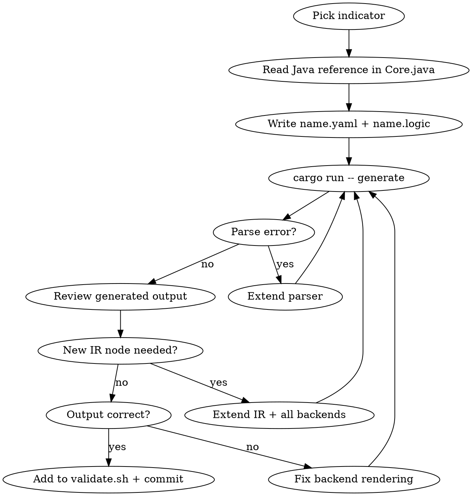

# Convert Indicator via ta_codegen

Add a TA-Lib indicator to the ta_codegen pipeline by writing YAML metadata + logic file, extending IR/parser/backends as needed, and validating across all 5 target languages.

## Usage

- `/convert-indicator` — resume current or pick next
- `/convert-indicator BBANDS` — work on specific indicator

## Workflow



## Step-by-step

### 1. Pick indicator

```bash
ls ta_func_defs/           # what exists
cargo run --release -- generate  # does current generation work?
```

**Progression** (each builds on previous capabilities): MULT -> SMA -> RSI -> EMA -> MA -> BBANDS -> DEMA -> TEMA -> WMA -> TRIMA -> KAMA -> T3 -> STOCH -> MACD -> ADX

### 2. Read the Java reference

Java is the known-working target. Search `Core.java` for the function:

```bash
grep -n "public RetCode functionName" java/src/com/tictactec/ta/lib/Core.java
```

Note: inputs, optional params, outputs, lookback calculation, and the core algorithm.

### 3. Write YAML metadata

Create `ta_func_defs/name/name.yaml`:

```yaml
name: NAME
group: Group Name
description: Human description
inputs:
  - name: inReal
    type: real
optional_inputs:
  - name: optInTimePeriod
    type: integer
    range: [2, 100000]
    default: 30
outputs:
  - name: outReal
    type: real
lookback: optInTimePeriod - 1
```

**Lookback formats:** literal (`0`), param-minus (`optInTimePeriod - 1`), or multi-line code (`lookback: |` with C-like statements).

### 4. Write the logic file

Create `ta_func_defs/name/name.logic`. Full syntax in `docs/ta_codegen_logic_syntax.md`.

**Rules:**
- Just the algorithm — no function signature, no validation, no return type
- C-like syntax: semicolons, parens around conditions, curly braces required
- Types: `double`, `int`, `size_t` (indices), `RetCode` (return codes)
- Final `return SUCCESS` is implicit — only use explicit return for early exits
- Function calls without prefix: `SMA(...)` not `TA_SMA(...)`
- Builtins: `UNSTABLE_PERIOD(name)`, `IS_ZERO(x)`, `ARRAY_COPY(dst,dOff,src,sOff,count)`, `PER_TO_K(period)`, `COMPATIBILITY`, `DEFAULT`, `METASTOCK`

### 5. Generate and iterate

```bash
cd tools/ta_codegen
cargo run --release -- generate
cargo test
```

If the parser panics or output is wrong, extend:

| Missing | Where |
|---|---|
| New statement type | `ir.rs` + `parser/logic.rs` + all 5 backends |
| New expression type | `ir.rs` + `parser/logic.rs` + all 5 backends |
| New builtin function | `render_func_call()` in each backend |
| New type keyword | `parser/logic.rs` (parse_var_decl + is_type_keyword) + backends |
| New variable mapping | `Expr::Var` match in each backend's `render_expr()` |

**When extending IR, you MUST update ALL 5 backends** or Rust exhaustiveness errors will tell you where.

### 6. Validate and commit

Add file checks to `tests/validate.sh`, then:

```bash
bash tests/validate.sh    # 0 failures required
```

MULT and SMA have byte-identical reference comparisons — if those break, your change is wrong.

## Key files

| File | Purpose |
|------|---------|
| `ta_func_defs/name/name.yaml` | Metadata: inputs, outputs, params, lookback |
| `ta_func_defs/name/name.logic` | Algorithm in C-like syntax |
| `tools/ta_codegen/src/ir.rs` | IR types (FuncDef, Statement, Expr, VarType) |
| `tools/ta_codegen/src/parser/logic.rs` | Tokenizer + recursive descent parser |
| `tools/ta_codegen/src/parser/yaml.rs` | YAML metadata parser |
| `tools/ta_codegen/src/backends/*.rs` | Language backends (rust_lang, c, java, dotnet, swig) |
| `tools/ta_codegen/src/server.rs` | JSON-RPC validation server |
| `tools/ta_codegen/tests/validate.sh` | Full validation harness |
| `docs/ta_codegen_logic_syntax.md` | Logic syntax reference |
| `java/src/com/tictactec/ta/lib/Core.java` | Java reference to match |

## Backend rendering

Each backend has the same structure:

- **`render_statement()`** — Statement variants (VarDecl, Assign, While, If, Switch, etc.)
- **`render_expr()`** — Expr variants (Var, Literal, BinOp, Cast, FuncCall, etc.)
- **`render_func_call()`** — builtins + TA function dispatch

**Function call dispatch per language:**

| Call in logic | C | Rust | Java |
|---|---|---|---|
| `SMA(...)` | `TA_SMA(...)` | `self.sma(...)` | `sma(...)` |
| `SMA_Lookback(...)` | `TA_SMA_Lookback(...)` | `self.sma_lookback(...)` | `smaLookback(...)` |
| Single-precision | `TA_S_SMA(...)` | `self.sma_s(...)` | overloaded |

## Complexity tiers

| Tier | Example | Features introduced |
|---|---|---|
| Simple loop | MULT | while, assign, array access |
| Accumulator | SMA | if/else, return, cast, running sum |
| Stateful | RSI | UNSTABLE_PERIOD, IS_ZERO, for-countdown, ARRAY_COPY, complex lookback |
| Recursive | EMA | PER_TO_K, DEFAULT/METASTOCK compat, operator precedence |
| Dispatcher | MA | switch/case, RetCodeType, function call dispatch, BAD_PARAM/SUCCESS |
| Multi-output | BBANDS | multiple output arrays, temp buffers |

## Changelog

After committing, update `RUST_CHANGELOG.md`:
- One entry per day, every commit gets a bullet
- `git diff first^..last` for inclusive local diffs
- `compare/<parent-of-first>...last` for GitHub URLs
- Summary bullet with total validation count at end
