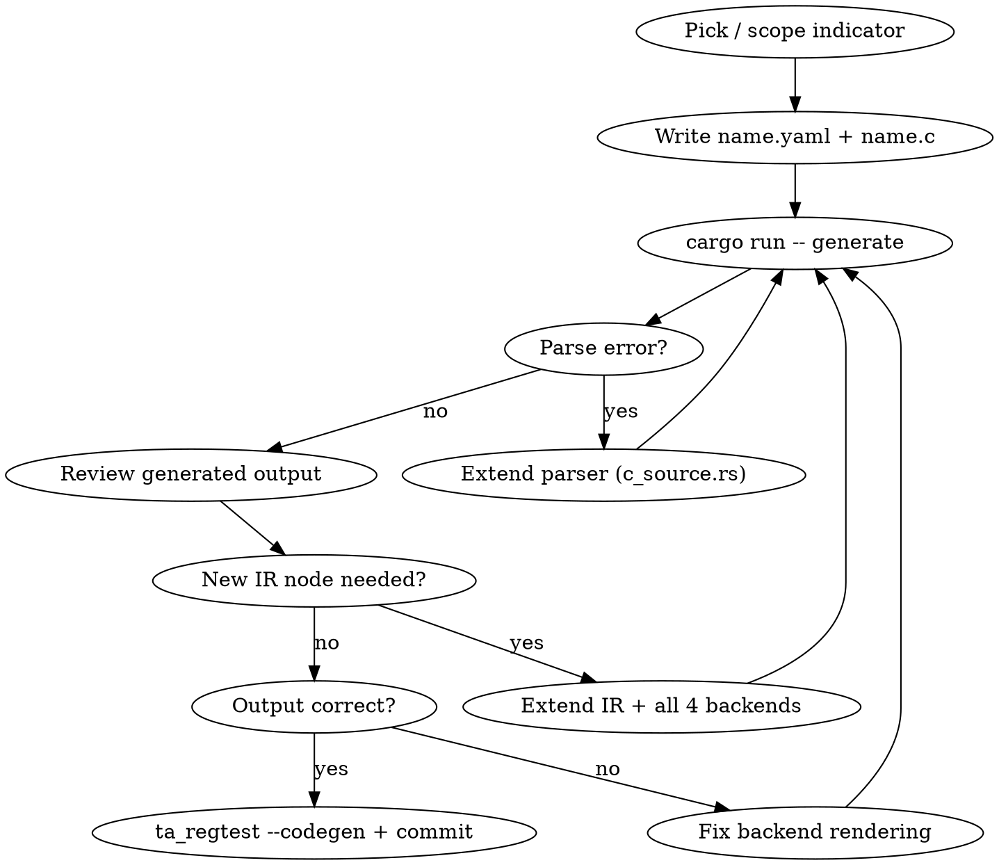

# Convert / Modify an Indicator via ta_codegen

`ta_codegen` (Rust, in `ta_codegen/generator/`) is the single code generator. Each
indicator is defined by two files in `ta_codegen/input/<name>/`:

- `<name>.yaml` — metadata (inputs, optional params, outputs, group, flags)
- `<name>.c` — the algorithm, written as plain C (see `docs/ta_codegen_logic_syntax.md`)

From these it generates all **four** backends: **C** (in place under `src/ta_func` /
`src/ta_abstract`), **Rust**, **Java**, **.NET** (under `ta_codegen/output/`).

> All ~161 indicators are already converted. Use this skill to **add a brand-new**
> indicator, **modify** an existing one, or **extend the generator** to support a new
> C construct. The correctness baseline is the frozen pre-cutover reference (the
> `reference-pre-cutover` tag, served as `ta_ref_serve`) plus ta_regtest's hardcoded
> expected values.

## Usage

- `/convert-indicator BBANDS` — work on a specific indicator
- `/convert-indicator` — resume in-progress work

## Workflow



## Step-by-step

### 1. Find / scope the indicator

```bash
ls ta_codegen/input/                 # existing definitions
ls ta_codegen/input/<name>/          # the target's .yaml + .c (if it already exists)
```

### 2. Write / adjust the metadata — `ta_codegen/input/<name>/<name>.yaml`

Full schema in `docs/ta_codegen_input_idl.md`. Example:

```yaml
name: SMA
camel_case: Sma
group: Overlap Studies
hint: Simple Moving Average
flags: [overlap]
inputs:
  - name: inReal
    type: real
optional_inputs:
  - name: optInTimePeriod
    type: integer
    display_name: Time Period
    range: [2, 100000]
    default: 30
    suggested: [4, 200, 1]
outputs:
  - name: outReal
    type: real
    flags: [line]
```

There is **no `lookback:` field** — lookback is a C function in the `.c` file (below).
Use `hint:` for the short description (not `description:`).

### 3. Write / adjust the logic — `ta_codegen/input/<name>/<name>.c`

Plain C, exactly as it would appear in `src/ta_func`: two functions,
`int <name>_lookback(...)` and
`TA_RetCode <name>(int startIdx, int endIdx, const double inReal[], ..., int *outBegIdx, int *outNBElement, double outReal[])`.
Full syntax and the `ta_defs.h` vocabulary (`TA_IS_ZERO`,
`TA_GetUnstablePeriod(TA_FUNC_UNST_X)`, `TA_COMPATIBILITY_*`, …) are in
`docs/ta_codegen_logic_syntax.md`.

**Rules:**

- A complete C function: full signature, `TA_RetCode` return, pointer/array outputs
  (`*outBegIdx = ...`, `outReal[outIdx] = ...`), `return TA_SUCCESS;`
- Do **not** write parameter validation or the guarded/unguarded split — the generator
  adds those
- Cross-indicator calls use the **bare lowercase name** (`sma(...)`,
  `ema_lookback(...)`); the generator routes them to the unguarded variant per language

### 4. Generate and iterate

```bash
cd ta_codegen/generator
cargo run --release -- generate --func=<NAME>
cargo test
```

If the parser panics or output is wrong, extend:

| Missing | Where |
|---|---|
| New statement type | `ir.rs` + `parser/c_source.rs` + all 4 backends |
| New expression type | `ir.rs` + `parser/c_source.rs` + all 4 backends |
| New builtin / macro | `backends/builtins.rs` + each backend's render |
| New type keyword | `parser/c_source.rs` + backends |
| New variable mapping | `Expr::Var` match in each backend's `render_expr()` |

**When extending the IR you MUST update ALL 4 backends** (C, Rust, Java, .NET) or Rust
exhaustiveness errors will point you to each.

### 5. Verify across languages and commit

```bash
scripts/build.py servers
cd bin && ./ta_regtest --codegen --function=<NAME>     # all langs vs the C reference
```

`git diff` the other backends' generated output to confirm an unrelated language
didn't change. SMA/MULT have byte-identical reference comparisons — if those break,
the change is wrong.

## Key files

| File | Purpose |
|------|---------|
| `ta_codegen/input/<name>/<name>.yaml` | Metadata: inputs, outputs, params, flags |
| `ta_codegen/input/<name>/<name>.c` | Algorithm (plain C) |
| `ta_codegen/generator/src/ir.rs` | IR types (FuncDef, Statement, Expr, ParamType) |
| `ta_codegen/generator/src/parser/c_source.rs` | C-source → IR parser |
| `ta_codegen/generator/src/parser/yaml.rs` | YAML metadata parser |
| `ta_codegen/generator/src/backends/*.rs` | Backends (c, rust_lang, java, dotnet) |
| `ta_codegen/generator/src/server_gen.rs` | JSON-RPC server generation |
| `ta_codegen/generator/tests/validate.sh` | Dev validation harness |
| `docs/ta_codegen_input_idl.md` | YAML schema reference |
| `docs/ta_codegen_logic_syntax.md` | `.c` logic / `ta_defs.h` macro reference |

## Backend rendering

Each backend has the same structure:

- **`render_statement()`** — Statement variants (VarDecl, Assign, While, If, Switch, …)
- **`render_expr()`** — Expr variants (Var, Literal, BinOp, Cast, FuncCall, …)
- builtins + cross-indicator dispatch (`backends/builtins.rs` + per-backend resolution)

**Cross-call dispatch per language** (a bare `sma(...)` in the `.c` file):

| Call in `<name>.c` | C | Rust | Java |
|---|---|---|---|
| `sma(...)` | `TA_SMA_Unguarded(...)` | `self.sma_unguarded(...)` | `smaUnguarded(...)` |
| `sma_lookback(...)` | `TA_SMA_Lookback(...)` | `self.sma_lookback(...)` | `smaLookback(...)` |

(C also emits single-precision `TA_S_*` variants automatically; there is no Rust `_s`
variant — Rust is concrete `f64`.)

## Complexity tiers (reference order of increasing difficulty)

| Tier | Example | Features |
|---|---|---|
| Simple loop | MULT | while, assign, array access |
| Accumulator | SMA | if/else, return, cast, running sum |
| Stateful | RSI | `TA_GetUnstablePeriod`, `TA_IS_ZERO`, for-loop, complex lookback |
| Recursive | EMA | k factor, `TA_COMPATIBILITY_*` compat, operator precedence |
| Dispatcher | MA | switch/case, cross-call dispatch, `TA_BAD_PARAM`/`TA_SUCCESS` |
| Multi-output | BBANDS | multiple output arrays |
